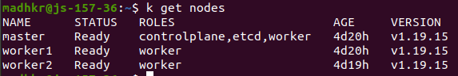
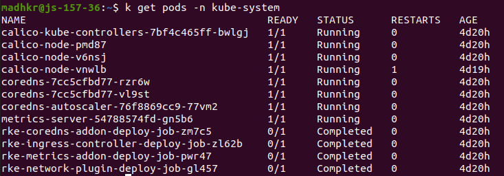
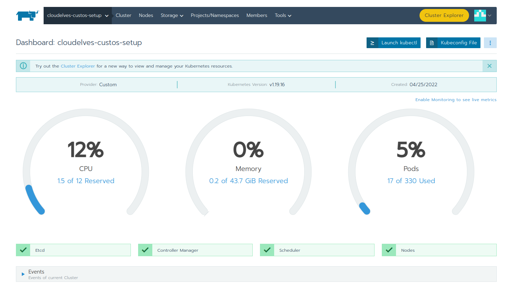
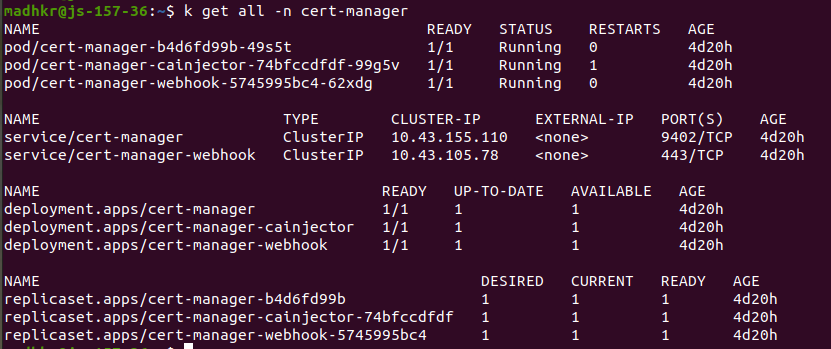
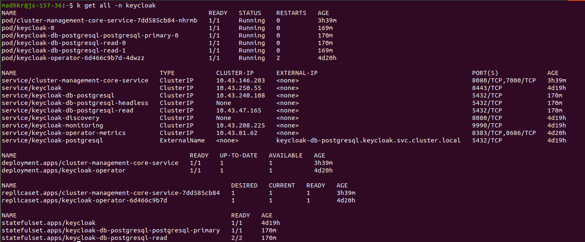
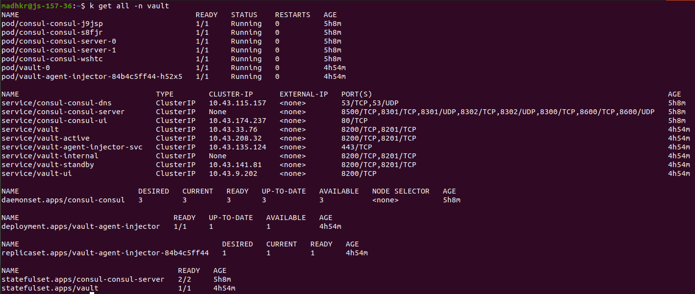
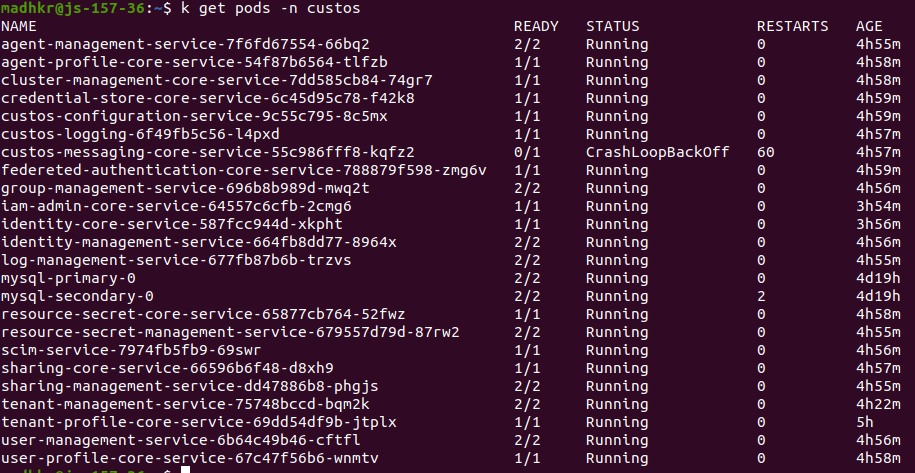

# CloudElves Custos Deployment

## Pre Requisites

### Kubernetes Cluster

**Platform:** Jetstream1

**Cluster Size:** Kubernetes cluster with 3 worker nodes - This can be 1 Master (with scheduling) + 2 Worker or 1 Master (W/o scheduling) + 3 Workers

**Node Size:** Each node is a medium vm on Jetstream 1 i.e 16 Gb RAM and 60 Gb Storage

**Kuberentes Version:** v1.19.*

**Deployment Type:** Using Rancher - Please [refer](https://github.com/airavata-courses/terra/wiki/Installing-Rancher---Step--1) this guide to deploy

#### Before anything, alias

```
alias k=kubectl
```

Once we have the kubernetes cluster, the validity can be established by running the following commands:

```
k get nodes
```



All the pods in kube-system namespace must be in read/completed state

```
k get pods -n kube-sytem
```



### Install Kubectl on Master node

Login to master node and run the following commands to install *kubectl* cli

```
curl -LO "https://dl.k8s.io/$(curl -L -s https://dl.k8s.io/release/stable.txt)/bin/linux/amd64/kubectl.sha256"
sudo install -o root -g root -m 0755 kubectl /usr/local/bin/kubectl
```

### Copy the .kubeconfig file from rancher

Copy the kubeconfig from the rancher ui (top right corner) for the kubernetes cluster:



In the master node, create .kube directory and under it, copy the kubeconfig from rancher to file config

```
mkdir ~/.kube
touch ~/.kube/config
```

### Installing Helm and adding repositories

Run the following commands in master node to install helm.

```
curl -fsSL -o get_helm.sh https://raw.githubusercontent.com/helm/helm/main/scripts/get-helm-3 
chmod 700 get_helm.sh 
./get_helm.sh
```

Add the following helm repositories:

```
helm repo add bitnami https://charts.bitnami.com/bitnami
helm repo add hashicorp https://helm.releases.hashicorp.com
```

## Deploying CertManager

```
k apply -f https://github.com/cert-manager/cert-manager/releases/download/v1.8.0/cert-manager.yaml

kubectl apply -f cert-manager/letsencrypt-prod-cluster-issuer.yaml

```




## Deploying KeyCloak

### create the namespace for keycloak

```
k create namespace keycloak
```

### installing postgres

```
k apply -f keycloak/pv.yaml
k apply -f keycloak/pv1.yaml
k apply -f keycloak/pv2.yaml

helm install keycloak-db-postgresql bitnami/postgresql -f postgresql-values.yaml -n keycloak --version 10.12.3

```

Fetch the postgres username and password using below commands and populate it accordingly in *keycloak/keycloak-db-secret.yaml*

```
export POSTGRES_ADMIN_PASSWORD=$(kubectl get secret --namespace keycloak keycloak-db-postgresql -o jsonpath="{.data.postgresql-postgres-password}" | base64 --decode)

export POSTGRES_PASSWORD=$(kubectl get secret --namespace keycloak keycloak-db-postgresql -o jsonpath="{.data.postgresql-password}" | base64 --decode)
```

### installing OLM

```
k create -f https://raw.githubusercontent.com/operator-framework/operator-lifecycle-manager/master/deploy/upstream/quickstart/crds.yaml

k create -f https://raw.githubusercontent.com/operator-framework/operator-lifecycle-manager/master/deploy/upstream/quickstart/olm.yaml
```

### installing keycloak operator

To do this, we have to first clone the keycloak operator repository and run *make cluster/prepare* on it.

```
git clone https://github.com/keycloak/keycloak-operator.git
cd keycloak-operator
make cluster/prepare
```

After the above step, run the operator.yaml

```
kubectl apply -f keycloak/operator.yaml -n keycloak
```

### installing the keycloak operator for custos

Apply the db secret (modified as suggested in above step) along with custos keycloak resource

```
kubectl apply -f keycloak/keycloak-db-secret.yaml -n keycloak

kubectl apply -f keycloak/custos-keycloak.yaml -n keycloak
```

### install ingress

update *keycloak/ingress.yaml* file in keycloak directory: update hostname in to master's hostname (js-157-36.jetstream-cloud.org)

```
k apply -f ingress.yaml -n keycloak
```

Once all the steps are done, if keycloak is deployed successfully, the pods in keycloak must be as follows:




### Getting keycloak username and password

The keycloak username and password will be available in the *secret/credential-custos-keycloak* in keycloak namespace

```
echo $(kubectl get secret --namespace keycloak credential-custos-keycloak -o jsonpath="{.data.ADMIN_USERNAME}" | base64 --decode)

echo $(kubectl get secret --namespace keycloak credential-custos-keycloak -o jsonpath="{.data.ADMIN_PASSWORD}" | base64 --decode)
```

You can use the above username and password to login to keycloak ui on *https://{hostname}:{nodeport}/auth*


## Deploying Vault

### Create namespace

```
k create namespace vault
```

### Installing consul

In each of the nodes, run the below commands
```
sudo mkdir -P /hashicorp/consul/data
chmod -R 777 /hashicorp
```

Create persistance volumes

```
k apply -f vault/pv.yaml
k apply -f vault/pv1.yaml
k apply -f vault/storage.yaml
```

install consul
```
helm install consul hashicorp/consul --version 0.31.1 -n vault --values vault/consul-config.yaml
```

### Installing vault

```
helm install vault hashicorp/vault --namespace vault -f vault/vault-values.yaml --version 0.10.0
```

#### Initializing and unsealing vault

First we need to initalize the vault to get root token and master keys

```
k exec -it vault-0 -n vault /bin/sh

# inside the container 
vault operator init

## Above command will generate 5 (or n) unseal keys. copy them for reference

vault operator unseal

## Above command will prompt for unseal keys. enter the keys copied one at a time, n times

## After successful unseal, you get a root token. save it for reference.

## verify root token by executing login command

vault login <root-token>
```

#### Create secret engines

1. Login  to UI
2. Enable new secret engine
3. select type "kv"
4. give name as "secret"
5. select version = 1

Repeat above steps to create another secret engine named "resourcesecret"

### Installing ingress

```
kubectl apply -f vault/ingress.yaml -n vault
```

After all the above steps are run, successful vault installation is indicated by below pod status:



You can also verify vault deployment by accessing its ui on *https://{hostname}:{nodeport}/*


## Deploying Custos Services

### Create namespace

```
k create namespace custos
```

### Install MySql

Create persistance volumes
```
k apply -f custos/pv.yaml
k apply -f custos/pv1.yaml
k apply -f custos/pv2.yaml
```

install mysql
```
helm install mysql bitnami/mysql -f values.yaml -n custos --version 8.8.8
```

get the root password for mysql using below command

```
echo $(kubectl get secret --namespace custos mysql -o jsonpath="{.data.mysql-root-password}" | base64 --decode)
```

### Deploy custos services

#### Clone Custos Repository

First, we need to clone the custos repository

```
git clone https://github.com/apache/airavata-custos.git
cd airavata-custos
git checkout develop
```

#### Modify root pom.xml

In root pom.xml do the following:

```
 <profile>
	<id>container</id>
	<properties>
		<spring.profiles.active>dev</spring.profiles.active>
		<vault.token>{vault-root-token}</vault.token>
		<vault.scheme>http</vault.scheme>
		<vault.host>vault.vault.svc.cluster.local</vault.host>
		<vault.port>8200</vault.port>
		<vault.uri>http://vault.vault.svc.cluster.local:8200</vault.uri>

		<iam.dev.username>admin</iam.dev.username>
		<iam.dev.password>{keycloak-admin-password}</iam.dev.password>
		<iam.staging.username>admin</iam.staging.username>
		<iam.staging.password>{keycloak-admin-password}</iam.staging.password>


		<custos.email.password>custos</custos.email.password>

		<spring.datasource.username>root</spring.datasource.username>
		<spring.datasource.password>{mysql-root-password}</spring.datasource.password>
	</properties>
	...
	...
 </profile>
```

Also near the end of pom.xml, make the following modifications

```
<host>{hostname}</host>

<ssh.privatekey>/path/to/privatekey/to/master</ssh.privatekey>

<ssh.passphrase>{passphrase if any}</ssh.passphrase>
<dozer.version>5.5.1</dozer.version>

<kafka-clients.version>1.0.0</kafka-clients.version>

<email.version>1.5.0-b01</email.version>
<ssh.username>{username}</ssh.username>
<project.version>1.0</project.version>
<clusterIssuer>letsencrypt-prod</clusterIssuer>

```

Add docker details

search for below tags and modify accordingly
```
<docker.image.prefix>docker.io/{yourdockerid}</docker.image.prefix>
<docker.image.repo>docker.io/{yourdockerid}</docker.image.repo>
```

#### Modify helm values.yaml

Modify *src/main/helm/values.yaml* in every project to point to your docker repo as below. replace all instances of *airavatacustos* with your docker id

```
image:
  repository: {your-docker-id}/${artifactId}
```

#### Modify custos-configuration-service pom.xml

**path:** *./airavata-custos/custos-core-services/utility-services/custos-configuration-service/pom.xml*

Modify **<skip>true</skip> to <skip>false</skip> under maven-antrun-plugins configuration**

#### Modify all dev and staging properties in custos-configuration-service

**path:**
1. _.airavata-custos/custos-core-services/utility-services/custos-configuration-service/src/main/resources/*-dev.properties_ 

2. _.airavata-custos/custos-core-services/utility-services/custos-configuration-service/src/main/resources/*-staging.properties_

Modify **iam.server.url=https://{hostname}:{nodeport}/auth/**


#### Comment out the some code to avoid errors

**path:** _.airavata-custos/custos-integration-services/tenant-management-service-parent/tenant-management-service/src/main/java/tasks/TenantActivationTask.java_

**action:** *comment lines 225-249*


### Prepare the master node

```
mkdir -P ~/custos/artifacts
chmod -R 777 ~/custos
```

### Prepare your local machine

Add the following to your maven settings under *</servers>*

```
<server>
	<id>docker.io</id>
	<username>{dockerhub_user}</username>
	<password>{dockerhub_password}</password>
	<configuration>
		<email>madhkr@iu.edu</email>
	</configuration>
</server>
```

### Deploy

```
mvn clean install -P container
mvn -s dockerfile:push -P container
mvn -s antrun:run -P scp-to-remote
```

once deployed, following must be pod status to assert correctness of deployment


### Redeploy iam-admin-core-service and identity-core-service with staging profile

Modify the profile in root pom.xml

```
<spring.profiles.active>staging</spring.profiles.active>
```

navigate to root of iam-admin-core-service and identity-core-service and run following commands.

You many want to manually uninstall these services before redeploying

```
helm uninstall -n custos iam-admin-core-service
helm uninstall -n custos identity-core-service
```

```
mvn clean install -P container
mvn -s dockerfile:push -P container
mvn -s antrun:run -P scp-to-remote
```



### One last step.. install cluster-management-core-service on keycloak namespace

```
cd ~/custos/artifacts

helm install cluster-management-core-service cluster-management-core-service-1.1.tgz -n keycloak
```

### Verifying installation

#### Register new tenant

**API:** https://{hostname}:{nodeport}/tenant-management/v1.0.0/oauth2/tenant
**Request:**
```
{
    "client_name":"cloudelves",
    "requester_email":"madhkr@iu.edu",
    "admin_username":"madhkr",
    "admin_first_name":"madhavan",
    "admin_last_name":"kr",
    "admin_email":"madhkr@iu.edu",
    "contacts":["madhkr@iu.edu","asangar@iu.edu"],
    "redirect_uris":["http://localhost:8080/callback*",
    "https://{host_name}/callback*"],
    "scope":"openid profile email org.cilogon.userinfo",
    "domain":"host_name",
    "admin_password":"madhkr",
    "client_uri":"host_name",
    "logo_uri":"host_name",
    "application_type":"web",
    "comment":"Custos super tenant for production"
}
```

#### Activate new tenant

API: https://{host_name}:{nodeport}/tenant-management/v1.0.0/status
Request:
```
{
"client_id":"client-id",
"status":"ACTIVE",
"super_tenant":true,
"updatedBy":"madhkr"
}
```

## References and Credits

1. Thanks to [Isuru Ranawaka](https://github.com/isururanawaka) for continuous support throughout the deployment process 

2. Thanks to [Shubam Mohapatra](https://github.com/shubhpatr) from team scapsulators for help with custos deployment.

3. Thanks to [GowthamChowta](https://github.com/GowthamChowta) from team terra for Kubernetes cluster deployment using rancher.

4. All deployment files are from [Source Custos Repository](https://github.com/apache/airavata-custos.git)

5. Setting up vault on kuberntes - [devopskube](https://devopscube.com/vault-in-kubernetes/)
