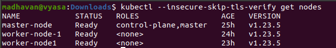

# Deploying Kubernetes on Jetstream cloud.

Follow the steps in [here](https://adamtheautomator.com/install-kubernetes-ubuntu/)

Consider modification suggested in [here](https://devops.stackexchange.com/questions/15162/it-seems-like-the-kubelet-isnt-running-or-healthy)

# Connecting to kubernetes cluster

## Installing kubectl 

Use this [link](https://kubernetes.io/docs/tasks/tools/) to install the command line **kubectl** for kubernetes.

Download the kubeconfig file from [here](https://github.com/airavata-courses/CloudElves/blob/kubernetes/kubeconfig)

Then, to connect to kubernetes cluster, you can do either of the following:
1) kubectl --kubeconfig=**/path/to/config-file** get all

2) set the environment variable **KUBECONFIG** to **/path/to/config-file** and use kubectl as is.

PS: If you face any certificate related error, add the option *--insecure-skip-tls-verify* to kubectl commands. (will fix this error soon)

**ex:** kubectl --insecure-skip-tls-verify --kubeconfig=config.yml get nodes

